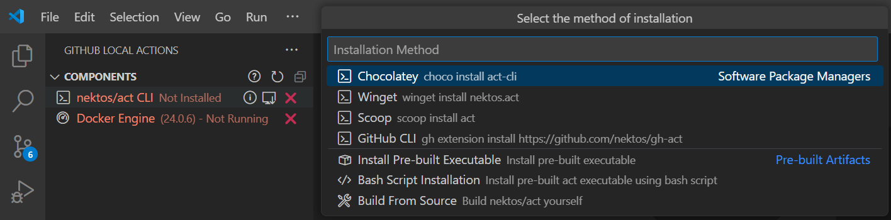

# GitHub Local Actions

Run your GitHub Actions locally with the power of the [GitHub Local Actions](https://marketplace.visualstudio.com/items?itemName=SanjulaGanepola.github-local-actions) VSCode extension! Say goodbye to the hassle of committing and pushing changes every time you need to test a workflow. This extension lets you quickly and efficiently run your workflows locally, leveraging the [nektos/act](https://github.com/nektos/act) CLI tool. Enjoy a seamless experience with an interface designed to feel as familiar as the official [GitHub Actions](https://marketplace.visualstudio.com/items?itemName=GitHub.vscode-github-actions) extension.

* 🚀 **Run Workflows/Jobs**: Run entire workflows or specific jobs locally without leaving your editor.
* ⚡ **Trigger Events**: Trigger standard [GitHub events](https://docs.github.com/en/actions/writing-workflows/choosing-when-your-workflow-runs/events-that-trigger-workflows) to run multiple workflows.
* 📖 **View Workflow Run History**: Track and investigate past workflow logs.
* ⚙️ **Manage Workflow Settings**: Define secrets, variables, inputs, and runners to be used when executing workflows.

## Components

The `Components` view is where you can manage the components which must be installed and started up before running any GitHub Actions.

1. [nektos/act](https://github.com/nektos/act): Act is a CLI tool responsible for executing your workflows locally. It can be installed via several software package managers or using a pre-built artifact.

    

2. [Docker Engine](https://docs.docker.com/engine/): Docker Engine is required for act to function as it uses Docker to handle workflow execution. The process includes:
    
    * Pulling or building the images specified in your workflow files
    * Determining the execution path based on your workflow's dependencies
    * Running containers for each action using the prepared images
    
    The containers are configured to mirror GitHub's environment, including matching [environment variables](https://docs.github.com/en/actions/writing-workflows/choosing-what-your-workflow-does/store-information-in-variables#default-environment-variables) and [filesystems](https://docs.github.com/en/actions/using-github-hosted-runners/using-github-hosted-runners#file-systems), ensuring a consistent and reliable local execution.

## Workflows

The `Workflows` view is where you can manage and run workflows locally. You have several options to execute a workflow:

1. **Run All Workflows**: Run all workflows in the workspace.
1. **Run Workflow**: Run an entire workflow.
2. **Run Job**: Run a specific job in a workflow.
3. **Run Event**: Run multiple workflows by triggering a [GitHub event](https://docs.github.com/en/actions/writing-workflows/choosing-when-your-workflow-runs/events-that-trigger-workflows).

## History

## Settings

## Bugs and Feature Requests

Feel free to share any bugs or feature requests in the project's [GitHub Issues](https://github.com/SanjulaGanepola/github-local-actions/issues) page.

## Contribution

Contributions are always welcome! Please see our contributing guide for more details.

## Maintainers

* [@SanjulaGanepola](https://github.com/SanjulaGanepola)